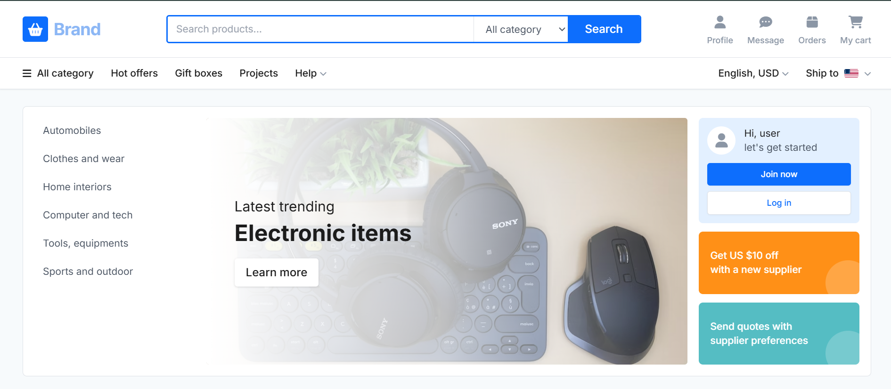
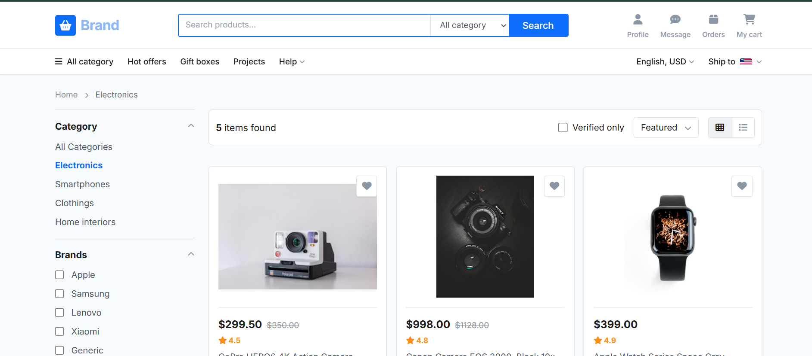
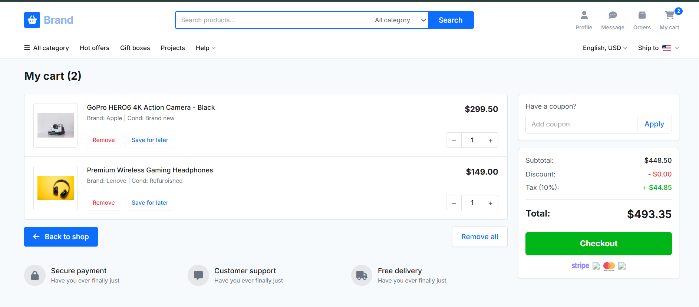

# 🛒 Brand E-Commerce — Responsive Web Application

> A modern, fully responsive e-commerce frontend built as part of the **[Developers Hub Corporation](https://github.com/DevelopersHubCorporation)** internship program.


---

## 📸 Preview

### Desktop View




---

## ✨ Features

### 🧭 Navigation & Routing
- **SPA-style routing** across Home, Product Listing, Product Detail, and Cart pages — no page reloads, smooth transitions.

### 🔍 Advanced Filtering
- Filter products by **category**, **brand**, **features**, **price range**, and **condition** for a precise shopping experience.

### 🛒 Interactive Cart
- Add and remove items, update quantities, and move products to a **"Saved for Later"** list seamlessly.

### 📦 Product Detail View
- High-resolution image gallery mock-up with **tabbed content** — Description, Reviews, and Shipping — plus a recommended products section.

### 📱 Fully Responsive Design
- Pixel-perfect layouts across **mobile**, **tablet**, and **desktop** viewports using Tailwind CSS utility classes.

### 📬 Engagement Components
- Built-in **supplier inquiry forms** and a **newsletter subscription** widget for lead capture.

---

## 🛠️ Tech Stack

| Technology | Purpose |
|---|---|
| HTML5 & CSS3 | Page structure and base styling |
| [Tailwind CSS](https://tailwindcss.com/) (CDN) | Utility-first responsive styling |
| Vanilla JavaScript | DOM manipulation & client-side state management |
| [Font Awesome](https://fontawesome.com/) | Icon library |
| [Google Fonts — Inter](https://fonts.google.com/specimen/Inter) | Typography |

---

## 📁 Project Structure

```
brand-ecommerce/
│
├── index.html          # App entry point — all structure, Tailwind config & UI sections
│
├── (embedded in index.html)
│   ├── Mock Data       # Built-in JS product array simulating a backend database
│   └── State Manager   # Custom JS logic for filters, cart updates & view transitions
```

> This is a single-file project — no build tools, bundlers, or package managers required.

---

## 🚀 Getting Started

### Prerequisites
Just a modern web browser (Chrome, Firefox, Edge, Safari).

### Installation

```bash
# 1. Clone the repository
git clone https://github.com/your-username/brand-ecommerce.git

# 2. Navigate into the project folder
cd brand-ecommerce

# 3. Open in your browser
open index.html
```

That's it! No `npm install`, no build steps, no environment setup.

---

## 🗺️ Roadmap

- [ ] Dark mode toggle
- [ ] Product search with live suggestions
- [ ] Checkout flow with order summary
- [ ] Backend integration (Node.js / Firebase)
- [ ] Unit tests for cart state logic

---

## 🤝 Contributing

Contributions, issues, and feature requests are welcome!

1. Fork the repository
2. Create a feature branch: `git checkout -b feature/your-feature-name`
3. Commit your changes: `git commit -m 'Add some feature'`
4. Push to the branch: `git push origin feature/your-feature-name`
5. Open a Pull Request

---

## 📜 License

This project is open source and available under the [MIT License](LICENSE).

---

## 🙌 Acknowledgements

- Built during the **Developers Hub Corporation** internship program
- UI inspiration from leading e-commerce platforms
- Icons provided by [Font Awesome](https://fontawesome.com/)
- Fonts by [Google Fonts](https://fonts.google.com/)
- Code assisted by [Gemini](https://gemini.google.com/)
